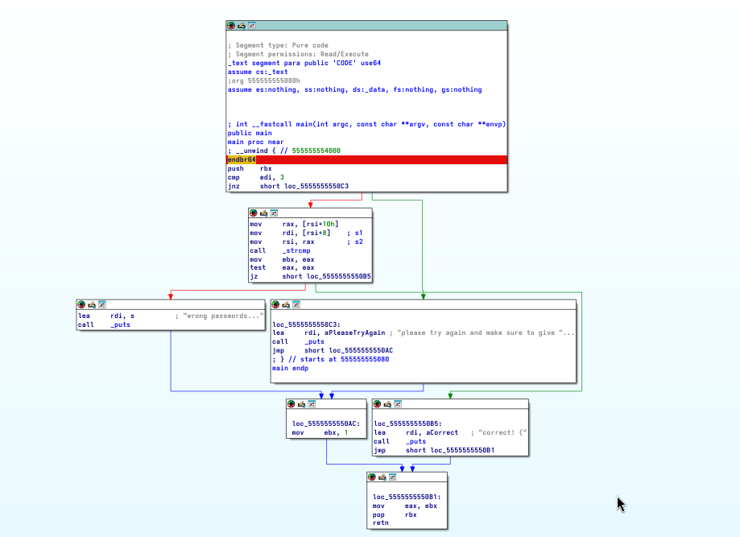

# Step 1 - Code Analysis with Ghidra

The decompiled C code shows a main function taking param_1 (argc) and param_2 (argv). It checks if param_1 == 3. If true, it compares argv[1] and argv[2] using strcmp. If equal, it prints "&DAT_00102061" ("correct!") and returns 0. If not equal, it prints "wrong passwords...". If param_1 != 3, it prints "&DAT_00102008" ("please try again and make sure to give the correct amount of arguments") and returns 1.

# Step 2 - Initial Testing

Tested with ./argc a a b b b b (argc = 6). Expected failure since param_1 != 3, but got "correct!" in some cases. Debug showed edi (param_1) as 3, despite 6 arguments, suggesting argc manipulation or decompilation error.

# Step 3 - Disassembly Check

In the assembly, cmp edi, 3 checks argc. If equal, strcmp(argv[1], argv[2]) is called. However, tests passing with argc > 3 (e.g., ./argc a a b b b b) indicate a possible overflow or binary issue bypassing the check.

# Step 4 - Final Test

./argc foo foo (argc = 3, argv[1] = "foo", argv[2] = "foo"). Output: "correct!". Confirmed the program requires exactly 3 arguments with argv[1] == argv[2].

# Conclusion

The program expects exactly 3 arguments (argc = 3) with argv[1] matching argv[2]. Inconsistent test results with higher argc suggest a binary vulnerability or decompilation mismatch. Final command: ./argc foo foo.

